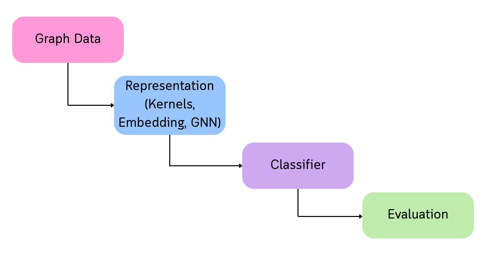
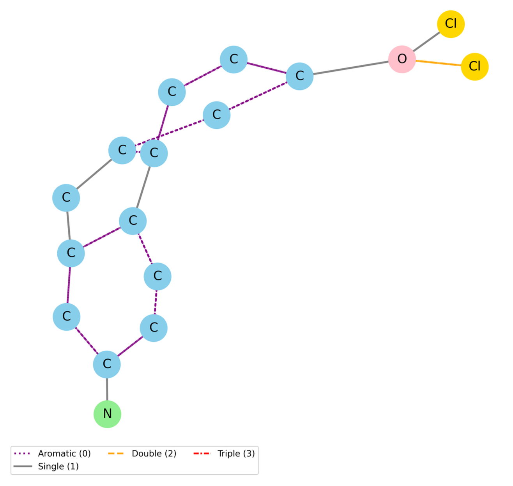
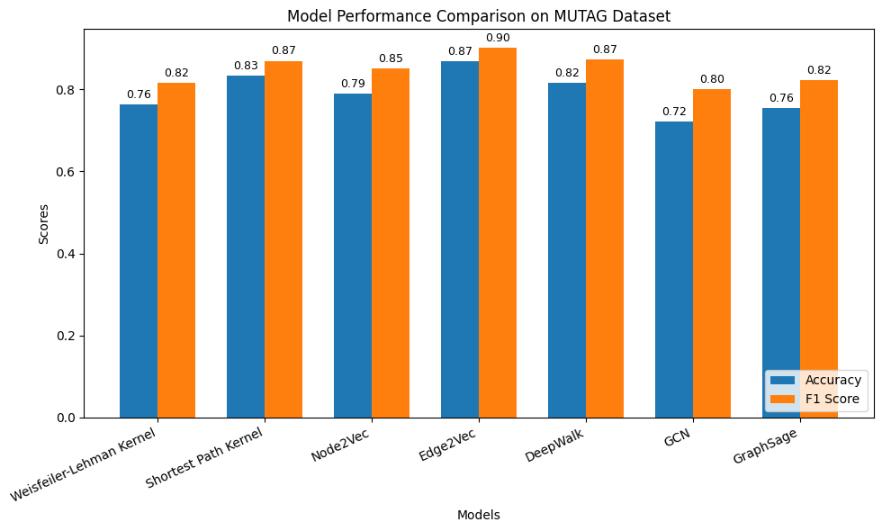

# Graph Classification on MUTAG

A comparative study of graph classification techniques on the MUTAG dataset using traditional graph representations and Graph Neural Networks (GNNs). This project evaluates multiple approaches for predicting molecular mutagenicity and analyzes their performance on a benchmark graph dataset.

---

## Workflow



---

## Overview

Graph classification is a fundamental task in graph machine learning, where an entire graph is assigned a class label. The MUTAG dataset consists of chemical compounds represented as graphs, with the objective of classifying each compound as mutagenic or non-mutagenic.

This project presents a comparative analysis of multiple graph classification methods, ranging from traditional techniques to deep learning-based Graph Neural Networks.

---

## Dataset

**Dataset:** MUTAG

**Description:** A benchmark graph dataset containing chemical compounds represented as graphs.

- **Number of Graphs:** 188
- **Classification Task:** Binary Classification
- **Classes:** Mutagenic / Non-Mutagenic
- **Node Labels:** Atom Types
- **Edge Labels:** Bond Types

---

## Methods Evaluated

The project compares different graph classification approaches, including:

- Graph Kernels
- Graph Embeddings
- Graph Convolutional Networks (GCN)
- GraphSAGE
- Other graph learning techniques implemented in the notebook

---

## Tech Stack

- Python
- Jupyter Notebook
- PyTorch
- PyTorch Geometric
- NumPy
- Pandas
- Matplotlib
- Scikit-learn

---

## Repository Structure

```
Graph-Classification-on-MUTAG/
│
├──MUTAG-GraphClassification.ipynb
├──images/
│   ├── workflow.png
│   ├──mutag_graph.png
│   ├──accuracy_f1_comp.png
├── README.md
├── requirements.txt
├── LICENSE
└── .gitignore
```

---

## How to Run

1. Clone the repository.
2. Install the required packages:

```bash
pip install -r requirements.txt
```

3. Open `MUTAG-GraphClassification.ipynb` in Jupyter Notebook or JupyterLab.
4. Run the notebook sequentially.

---

## Sample Graph



---

## Results

The implemented methods were evaluated using standard graph classification metrics to compare their predictive performance on the MUTAG dataset. The study highlights the strengths and limitations of traditional graph learning techniques and Graph Neural Networks for molecular graph classification.

### Performance Comparison



---

## Publication

This work contributed to the book chapter **"Graph-Based Classification Methods for Detecting Mutagenicity"**, published in **_Emerging Dimensions in Biotechnology: Research, Innovation and Application (Volume 1)_** by AGROBIOS (India), 2026.

---

## Future Work

- Evaluate additional Graph Neural Network architectures
- Perform hyperparameter optimization
- Extend the study to larger benchmark graph datasets
- Investigate graph transformers for graph classification

---

## Acknowledgements

- MUTAG Benchmark Dataset
- PyTorch Geometric
- PyTorch

---

## License

This project is licensed under the MIT License.
